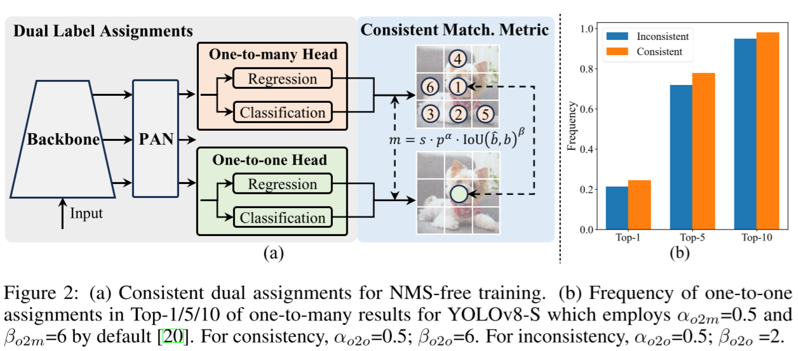
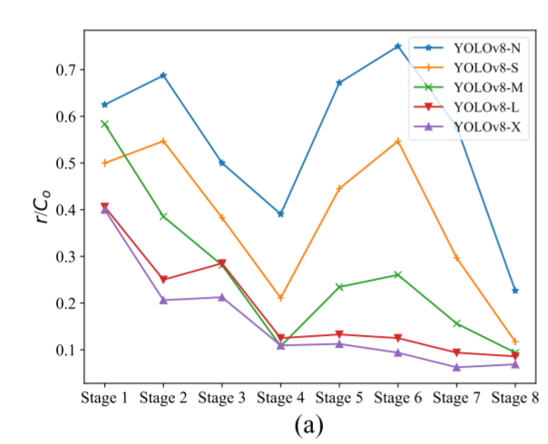
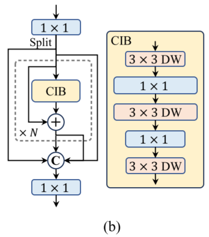
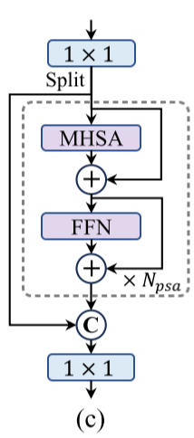
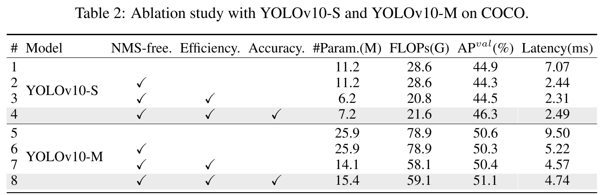
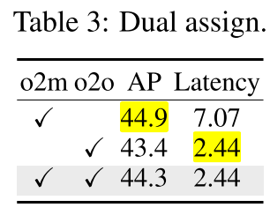
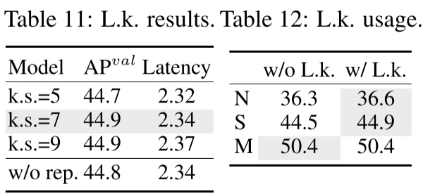
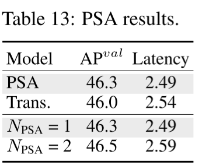

# Consistent Dual Assignments for NMS-free Training

传统 YOLO 算法中会在训练时对 IoU 大的前 k 个 bounding box 进行训练，最后在 post-process 中对 IoU 较高的同类别 bounding box 使用 NMS 筛选。NMS步骤会拖慢推理速度，因此作者提出 dual label assignments 实现 NMS-free 的检测。

## Dual label assignments

one-to-one matching assignment 能够避免 NMS 带来的推理速度慢的问题，但是其训练难度大。



如上图，yolo v10 在之前的 one-to-many 基础上加上 
**one-to-one** 头：

> It retains the identical structure and **adopts the same optimization objectives** as the original one-to-many branch but leverages the one-to-one matching to obtain label assignments.
> 
> Besides, in the one-to-one matching, we adopt the top one selection.

yolo v10 的选择是在训练的时候利用 one-to-many 辅助 one-to-one 进行训练，在推理时只是用 one-to-one 的头进行推理。

我的理解是 one-to-many 中使用 k 个 bounding box 进行训练可以给 backbone 和 neck 部分提供更多的信息，而最终分类器只使用  one-to-one 则是避免最后的分类多个 anchors 检测同一 instance 并且 score 都不低的情况。

## Consistent matching metric

### 损失函数选择

根据上面的描述，one-to-one 和 one-to-many 使用的是相同的匹配标准，如下：

$$
m(\alpha, \beta) = s \cdot p^{\alpha} \cdot IoU(\hat{b}, b)^{\beta}
$$

参数：
- $p$ 是分类得分
- $\hat{b}$ 和 $b$ 是预测和实际的 bounding box
- $\alpha$ 和 $\beta$ 是平衡分类和定位任务的超参数（**the semantic prediction task** and **the location regression task**）
- $s$ 是空间先验参数，indicating whether the anchor point of prediction is within the instance

- [x] $s$ 参数并没有搞清楚来源

上面公式中，针对 one-to-one 和 one-to-many 有不同的 $\alpha$ 和 $\beta$ 值，文中表述为 $m({\alpha}_{o2o}, {\beta}_{o2o})$ 和 $m({\alpha}_{o2m}, {\beta}_{o2m})$。

## o2o 和 o2m 任务的对齐

关于两个损失函数的的对齐，看了一下[原文的代码实现](https://github.com/THU-MIG/yolov10/commit/8d9f45a9557f25dbf75e3c9c95ac86bb8b97ba7c#diff-d2ac3773214d5694c3286cf9534fc4914555f1a3f5c5ae4a99c6aff00c75892dR721)，这里更多是参考 yolov8 的损失函数：
```python
# file path: ultralytics/utils/loss.py
class v10DetectLoss:
    def __init__(self, model):
        self.one2many = v8DetectionLoss(model, tal_topk=10)
        self.one2one = v8DetectionLoss(model, tal_topk=1)
    
    def __call__(self, preds, batch):
        one2many = preds["one2many"]
        loss_one2many = self.one2many(one2many, batch)
        one2one = preds["one2one"]
        loss_one2one = self.one2one(one2one, batch)
        # loss[0]: box gain; loss[1]: cls gain
        return loss_one2many[0] + loss_one2one[0], torch.cat((loss_one2many[1], loss_one2one[1]))
```

注意最后两个任务损失函数的使用：bounding box 是 loss 值进行相加，而 cls 为 `cat` 后分别进行反向传播。

作者[关于 loss 这里 issue 的回答 ](https://github.com/THU-MIG/yolov10/issues/53)，论文附录有进行证明，这里就只放结论了:
> onsistent matching metric的结论是**两个分支的分类和回归的权重需要成相同比例**，我们这里默认比例取为1，等价于体现在这两个分支的 α 和 β 相同。

即 ${\alpha}_{o2o} = {\alpha}_{o2m}, {\beta}_{o2o} = {\beta}_{o2m}$。

# Holistic Efficiency-Accuracy Driven Model Design

yolo v10 对网络结构进行了一些调整，并不算特别新颖，可以当作训练效果不如预期或者想降低复杂度时可选的 tricks。

## Efficiency driven model design

这一部分主要是在不影响准确率的前提下轻量化网络。

### Lightweight classification head

作者分析：
> The FLOPs and parameter count of the **classification** head are **2.5× and 2.4×** those of the **regression** head in YOLOv8-S. 
> 
> The **regression** head **undertakes more** significance for the performance of YOLOs.

因此作者对分类头的卷积使用 depth-wise convolution 进行替换，减少分类头的参数。

### Spatial-channel decoupled downsampling

常见的卷积操作会在 spatial downsampling （$H,W \rightarrow \frac{H}{2}, \frac{W}{2}$）同时进行 channel 的变化 （$C \rightarrow 2C$）。

作者将 downsampling 操作和 channel 的操作进行分离，先进行 downsampling （depthwise conv）后进行 channel 的操作（pointwise conv），减少参数量和计算量。

### Rank-guided block design



上图纵轴是不同stage中各个通道矩阵秩超过${\lambda}_{max}/2$ 的个数和输出通道数的比值，作者用上图想说明实际网络的冗余度较大，因此作者利用这个作为简化网络的指导。

这里作者进行简化的手段还是使用 depthwise convolution 进行，这里引入 a compact inverted block (CIB) structure 对传统的 convolution 进行替换（感觉很常见的……）


整体的修改流程也比较简单：
1. 替换为 CIB 模块
2. 计算AP，如果表现不降低就保存修改

## Accuracy driven model design

为了提升准确率，作者在深层 CIB 模块中使用 7x7 的**大卷积核**获得更大的视野域，这里还提到一个推理时的一个小 trick （结构重参数化）。

除此之外，作者引入了 Partial **self-attention** (PSA) 增加全局的感知。为了减少参数量，只对部分channel增加注意力机制，另为了推理速度，使用 batchnorm 代替 NLP 注意力机制中使用的 layernorm。



# Experiment

消融实验：




从上面实验结果可以看到，o2m的效果更好（更充分的训练），o2o 的推理速度好些（NMS-free）。可能 dual label assignments 的方法还有优化的空间。



从上面关于使用 large kernel 的实验可以观察到：
1. 并不是 kernel 越大效果就越好
2. 大模型使用 large kernel并没有收益



PSA brings 0.3% AP improvement with 0.05ms latency reduction. The performance enhancement may be attributed to the alleviation of optimization problem in self-attention, by mitigating the redundancy in attention heads. 

$\uparrow$ 没说服我 /(ㄒoㄒ)/~~

- [x] Cvt: Introducing convolutions to vision transformers.

> The CNN architecture forces the capture of this **local structure** by using
 local receptive fields, shared weights, and spatial subsampling, and thus also achieves some degree of shift,
 scale, and distortion invariance.
>
> Convolutions can be
 strategically introduced to the ViT structure to **improve
 performance and robustness**, while concurrently maintaining a high degree of computational and memory efficiency.