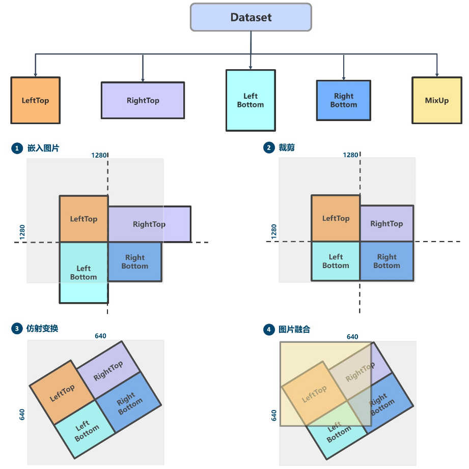
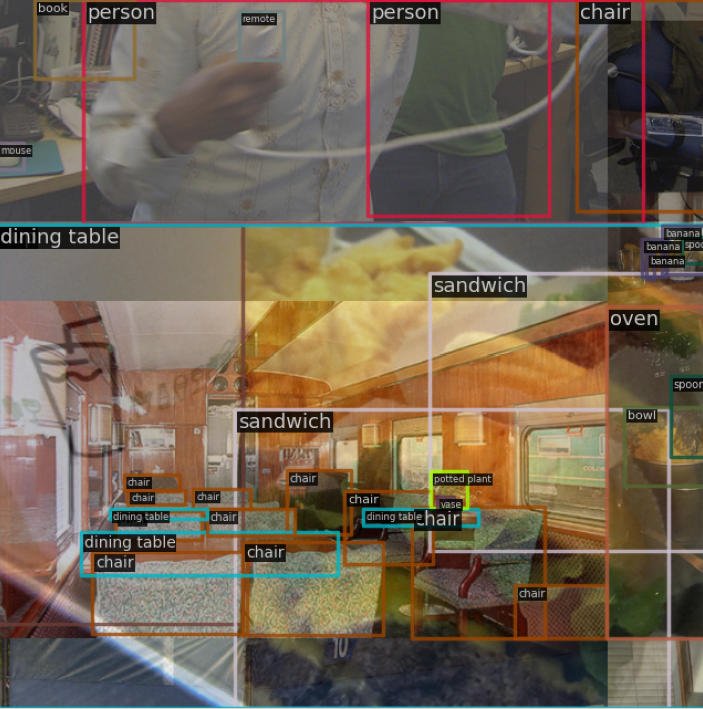
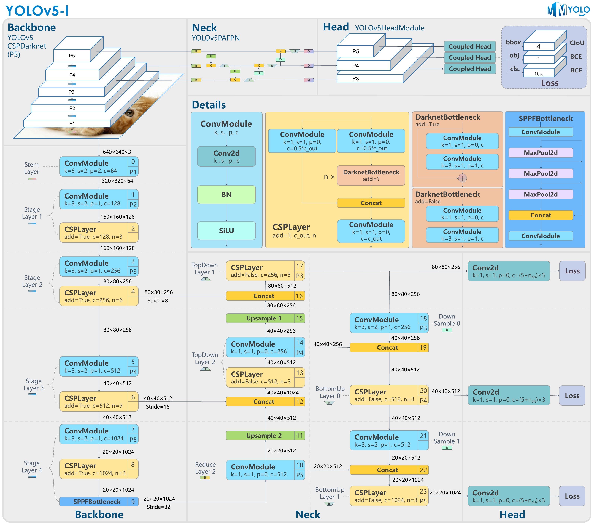
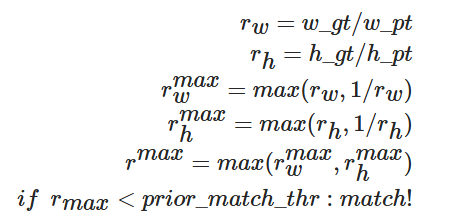
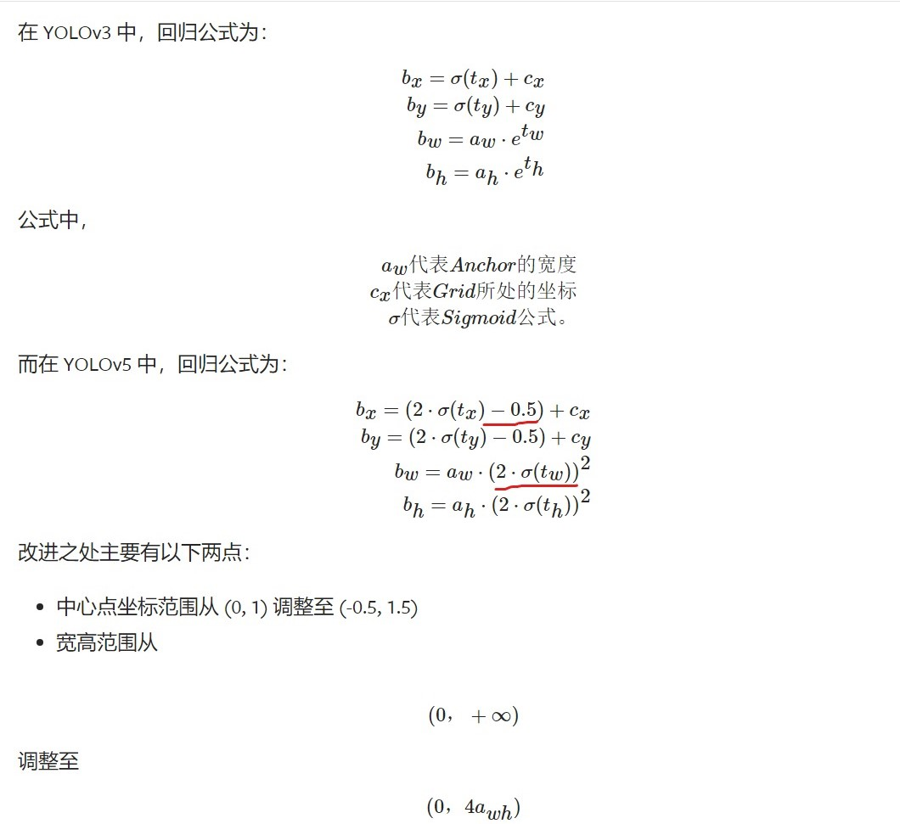
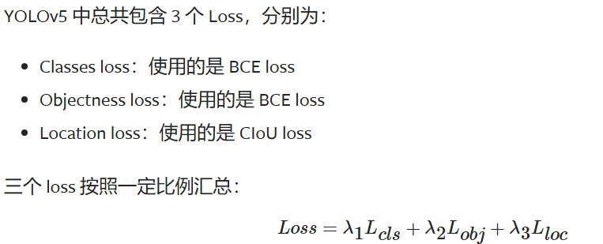

[Ref](https://mmyolo.readthedocs.io/zh-cn/latest/recommended_topics/algorithm_descriptions/yolov5_description.html#v6-1-mmyolo)

# 数据增强

YOLOv5 目标检测算法中使用的数据增强比较多，包括：
- Mosaic 马赛克
- RandomAffine 随机仿射变换
- MixUp
- 图像模糊等采用 Albu 库实现的变换
- HSV 颜色空间增强
- 随机水平翻转

其中 Mosaic 数据增强概率为 1，表示一定会触发，而对于 small 和 nano 两个版本的模型不使用 MixUp，其他的 l/m/x 系列模型则采用了 0.1 的概率触发 MixUp。**小模型能力有限，一般不会采用 MixUp 等强数据增强策略**。

## Mosaic 马赛克

大概流程是：
1. 随机选取四张图片交接的中心点，固定长宽比进行 resize
2. 对于图片超出边界的部分进行剪裁，其余位置全部补 114 像素值

上图中可以看到嵌入图片的尺寸由 640x640 变成 1280x1280，因此使用随机仿射变换对尺寸再进行缩放。

## RandomAffine 随机仿射变换

随机仿射变换有两个目的：
- 对图片进行随机几何仿射变换
- 将 Mosaic 输出的扩大 4 倍的图片还原为 640x640 尺寸

随机仿射变换包括平移、旋转、缩放、错切等几何增强操作，同时由于 Mosaic 和 RandomAffine 属于比较强的增强操作，会引入较大噪声，因此需要对增强后的标注进行处理。

## MixUp

Mixup 是随机选出另外一张图后将两图再随机混合，注意两张图都是经过 Mosaic 和 RandomAffine 的：

## 其他数据增强

1. 图像模糊等采用 Albu 库实现的变换
2. HSV 颜色空间增强
3. 随机水平翻转

# 网络结构

YOLOv5 网络结构是标准的 CSPDarknet + PAFPN + 非解耦 Head。

# 正负样本匹配策略

YOLOV5 的匹配策略简单总结为：采用了 anchor 和 gt_bbox 的 **shape 匹配度**作为划分规则，同时引入**跨邻域网格策略**来增加正样本。 其主要包括如下两个核心步骤：
1. 对于任何一个输出层，抛弃了常用的基于 Max IoU 匹配的规则，而是直接采用 shape 规则匹配，也就是该 GT Bbox 和当前层的 Anchor 计算宽高比，**如果宽高比例大于设定阈值**，则说明该 GT Bbox 和 Anchor 匹配度不够，将该 GT Bbox **暂时丢掉**，在该层预测中该 GT Bbox 对应的网格内的预测位置认为是负样本
   
2. 对于剩下的 GT Bbox(也就是匹配上的 GT Bbox)，计算其落在哪个网格内，同时利用四舍五入规则，**找出最近的两个网格**，将这三个网格都认为是负责预测该 GT Bbox 的，可以粗略估计正样本数相比之前的 YOLO 系列，至少增加了三倍

## Bbox编解码

上图中可以看到有两点优化：
1. 中心点从$(0,1)$变为$(-0.5,1.5)$，使得中心点能够覆盖到 grid 的边界
2. $b_w$ 和 $b_h$ 的变更使得范围从 $(0,+\infty)$ 变为 $(0, 4a_{wh})$ 使得该变量的梯度可控，而不是 exp 可能的无穷大

# 损失函数

